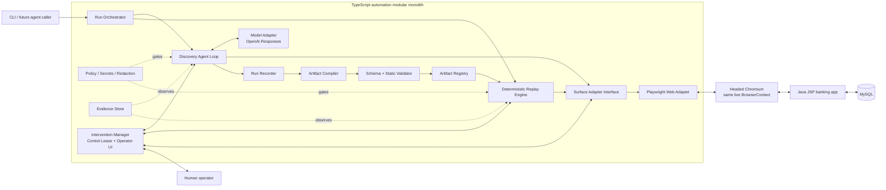

# LLM Hands — Architecture and Major Decisions

**Status:** Accepted design for the assignment MVP  
**Target application:** the existing Dockerized Java/Spring Boot/JSP banking application  
**Primary capability:** `lookup_customer_account`  
**Decision rule:** optimize first for the assignment's evaluation order: system design, a real discovery-to-replay vertical slice, explicit runtime outcomes, live-session human handoff, safety, and explainability. Optimize second for feature count.

## 1. Executive decision

Keep the legacy banking application in Java and build the computer-use system as a separate **TypeScript modular monolith** under `automation/`. Run the banking app and MySQL in Docker, but run the automation process on the host during the demo so a human can take over the same visible Chromium session.

The automation system will use:

- **Node.js 24 LTS + TypeScript** for the engine.
- **Playwright** as the first `SurfaceAdapter` implementation.
- **Hybrid perception:** a screenshot plus a sanitized semantic/DOM inventory and accessibility information. The system must not assume test IDs or a clean DOM.
- **OpenAI Responses API**, initially with `gpt-5.6-terra`, for discovery only. The model is configurable through `OPENAI_MODEL` and receives a constrained action schema rather than unrestricted browser or code execution.
- **Zod** as the runtime source of truth for model decisions, capability artifacts, configuration, and replay results; generated JSON Schema makes artifacts reviewable outside TypeScript.
- **A deterministic compiler and replay state machine.** The model discovers a flow; it does not write executable code and it is never invoked to make replay decisions.
- **Fastify plus a minimal server-rendered operator page** for intervention status and resume/abort controls. The human operates the already-open headed browser window, preserving its cookies and live session.
- **Pino JSONL logs, Playwright traces, sanitized screenshots, and DOM/accessibility snapshots** for evidence.
- **Filesystem JSON/JSONL artifacts for the assignment**, with repository interfaces that could later be backed by object storage or a database. No queue, cluster, workflow platform, or microservices are justified for this vertical slice.

TypeScript remains the best choice here. Java would reduce the number of languages, and Python has a strong AI ecosystem, but neither advantage outweighs Playwright's excellent TypeScript API, the ability to share discriminated unions from LLM action output through compilation and replay, and the speed of building a typed end-to-end slice. The legacy app is intentionally a separate system boundary; matching its language would incorrectly couple automation to the target.

## 2. Assignment-to-design traceability

| Assignment priority | Concrete design response |
|---|---|
| Real goal-driven computer use | A bounded observe → decide → validate → act loop operates the live JSP UI through Playwright. |
| Typed, reusable artifact | Versioned Zod/JSON Schema contract with inputs, outputs, generic actions, locator bundles, checkpoints, outcomes, metadata, and lifecycle state. |
| Deterministic replay | A separate replay engine binds typed inputs and executes the saved steps with no model calls. |
| Runtime error handling | A result union separates success, expected business outcomes, needs-human states, and hard failures. Retries are bounded and only allowed for declared recoverable/idempotent cases. |
| Human takeover | A real control lease pauses automation and gives the visible, existing BrowserContext to a human before a verified handback. |
| Safety | Origin/route/action allowlists, risk classes, secret references, redaction, and fail-closed policy checks before every action. |
| Observability | Correlated JSONL events plus Playwright trace, screenshot, and state snapshots. |
| Legacy/heterogeneous design | Surface-neutral artifact actions and locator descriptors sit above a web-specific Playwright adapter. |
| Multi-tenant design | Immutable base artifact plus product-version fingerprint and tenant/variant bindings with narrowly scoped overrides. |
| Appropriate simplicity | One TypeScript process with explicit modules and interfaces; Java app and MySQL remain external target services. |

## 3. Target workflow

The primary demonstration goal is:

> Log in as authorized staff, find the customer identified by the supplied username, open the matching record, and return the account number and current balance.

Contract:

- Input: `customerUsername: string`.
- Runtime secrets: `BANK_STAFF_USERNAME` and `BANK_STAFF_PASSWORD`; these are not capability inputs and never appear in the artifact or logs.
- Outputs:
  - `accountNumber: string` because identifiers must not be treated as arithmetic values.
  - `currentBalance: { amount: string; currency: "USD" }` because floating-point numbers are unsuitable for money.
- Expected business outcome: `CUSTOMER_NOT_FOUND`.
- Recoverable conditions: transient load timeout, known session expiry with at most one reauthentication attempt, or a known dismissible dialog.
- Hard/blocked conditions: access denied, ambiguous target, unsupported page, failed checkpoint, policy denial, or repeated no-progress state.

This target is appropriate because it is local and safe, represents a staff console, crosses login/search/list/detail pages, uses server-rendered tables and forms without test IDs, and exposes realistic runtime outcomes.

## 4. Component and data-flow architecture

The boxes below are **modules or runtime boundaries**, not events. Arrows show calls and data flow. All TypeScript modules initially live in one process, while the Java application and MySQL are separate Docker services.



### Module responsibilities

| Module | Responsibility | Must not do |
|---|---|---|
| Run Orchestrator | Starts a discovery or replay run, creates IDs/deadlines, owns the run state machine, returns the final typed result. | Contain Playwright selectors or model prompts. |
| Discovery Agent Loop | Repeatedly observes, asks the model for one constrained decision, validates it, policy-checks it, executes it, and detects progress/stopping conditions. | Save raw model prose as a capability or bypass policy. |
| Model Adapter | Converts the observation into a provider request and returns a validated `DiscoveryDecision`. | Touch the browser or decide replay behavior. |
| Surface Adapter | Defines generic observe, resolve, act, snapshot, pause, and resume operations. | Know capability business semantics. |
| Playwright Web Adapter | Implements the surface contract for pages, frames, locators, dialogs, screenshots, and browser contexts. | Call the LLM or compile artifacts. |
| Run Recorder | Writes sanitized observations, decisions, resolved-target facts, actions, checkpoints, and evidence references to an append-only trace. | Infer replay steps from prose. |
| Artifact Compiler | Deterministically normalizes a successful trace, replaces values with typed input/secret references, builds ordered locator bundles, and emits a draft artifact. | Invoke an LLM or emit executable JavaScript. |
| Schema + Static Validator | Rejects missing checkpoints, raw secrets, unsupported actions, unbounded retries, weak locators, undeclared outputs, and incompatible versions. | Repair ambiguous artifacts silently. |
| Artifact Registry | Loads artifacts by stable ID/version and stores immutable versions plus lifecycle state. | Mix artifacts with tenant secrets. |
| Replay Engine | Binds inputs, verifies preconditions, executes declared steps, classifies outcomes, extracts outputs, and verifies success with no LLM decisions. | Invent steps or silently continue after a failed checkpoint. |
| Policy Engine | Enforces origins/routes/actions, risk approvals, limits, and data-handling rules before execution. | Rely on the model to self-police. |
| Intervention Manager | Creates intervention requests, transfers the control lease, preserves the same browser context, records manual activity, and verifies handback. | Launch a fresh session for the operator. |
| Evidence Store | Produces a run manifest, redacted JSONL logs, screenshots/snapshots, and traces keyed by run/step IDs. | Store passwords, tokens, raw cookies, or unrestricted PII. |

## 5. Repository layout

Do not reorganize the existing Java project. Add the automation system beside it:

```text
/
├── src/                         # existing Java/Spring/JSP target
├── database/                    # existing local demo data
├── Dockerfile
├── compose.yaml
├── automation/
│   ├── package.json
│   ├── tsconfig.json
│   ├── src/
│   │   ├── cli/
│   │   ├── domain/              # Zod schemas and shared result/action types
│   │   ├── orchestrator/
│   │   ├── discovery/
│   │   ├── compiler/
│   │   ├── replay/
│   │   ├── surfaces/
│   │   │   ├── surface-adapter.ts
│   │   │   └── web/playwright-web-adapter.ts
│   │   ├── policy/
│   │   ├── intervention/
│   │   ├── evidence/
│   │   └── registry/
│   ├── schemas/                 # generated JSON Schemas
│   └── test/
├── artifacts/                   # reusable capability definitions
├── policies/                    # checked-in non-secret policy configuration
├── evidence/                    # required assignment proof, sanitized
├── ARCHITECTURE_DECISIONS.md
├── REPORT.md                    # final 1–3 page submission summary
└── README.md                    # exact setup and demo commands
```

## 6. Technology decisions and trade-offs

### 6.1 TypeScript on Node.js 24 LTS

**Chosen over Java:** the target's Java code is not an integration API and should remain opaque to the automation. Sharing a JVM would not improve UI control, while it would make the design look coupled to one app.

**Chosen over Python:** Python is excellent for experimental agents, but TypeScript provides a stronger single type path through Playwright actions, Zod runtime validation, artifact compilation, and Fastify endpoints. That directly supports the schema- and contract-heavy evaluation.

Pin the Node major and all package versions in the lockfile. The exact installed model and package versions are also written into every run manifest.

### 6.2 Playwright library, not Selenium, Puppeteer, or a vendor CUA SDK

Playwright offers browser contexts, frame support, actionability checks, semantic locators, tracing, screenshots, and a strong TypeScript API. It is a better fit than Selenium for a compact modern implementation and provides more batteries for evidence and isolation than Puppeteer.

Do **not** let the model call Playwright directly or generate JavaScript. The model chooses from the engine's small action schema; the adapter executes it. This keeps policy, recording, and replay under our control and preserves the future desktop seam.

### 6.3 Hybrid perception, semantic-first execution

Discovery observations contain:

1. Current URL, title, frame tree, dialog state, and page fingerprint.
2. A sanitized list of visible interactive elements with ephemeral IDs, roles, labels/text, attributes, frame path, and bounding boxes.
3. A screenshot for non-semantic or visually confusing layouts.
4. The prior action result and compact progress history.

The model normally selects an ephemeral element ID. Screenshot coordinates are allowed only as a discovery fallback and are policy-checked. The recorder then captures what element was actually resolved. Compilation prefers semantic/user-facing facts, then short scoped CSS/name attributes, then visual anchors. Absolute coordinates are never the sole locator in an unattended approved artifact.

This is stronger than DOM-only automation on legacy markup and more deterministic and inspectable than vision-only coordinates.

### 6.4 OpenAI Responses API with a provider seam

Initial implementation: `OpenAIModelAdapter` using `gpt-5.6-terra`, selected for its balance of capability and cost and its support for image input and structured outputs. `OPENAI_MODEL` can override it without changing domain code. Record the exact returned model ID and prompt version in discovery evidence.

Use the Responses API with `store: false` and JSON Schema structured output. Do not use the hosted computer-use tool for the MVP: the project is specifically evaluating our artifact, replay, guardrail, and handoff architecture, so browser control must pass through our own action and policy contracts.

The only provider-facing interface is conceptually:

```ts
interface DiscoveryModel {
  decide(input: SanitizedAgentTurn): Promise<DiscoveryDecision>;
}
```

The artifact contains no provider name, model ID, prompt text, or transcript. Replay remains provider-independent.

### 6.5 Modular monolith and synchronous runs

Use one process and explicit internal interfaces. A discovery or replay run is a synchronous state machine with an overall timeout and cancellation signal. This is easier to inspect and demo, and it avoids building queues and distributed coordination that the brief explicitly does not reward.

Future scaling can place the orchestrator behind a job queue because run state, evidence, artifact storage, and surface sessions already have interfaces. That future is not part of the MVP.

### 6.6 Filesystem persistence

Use immutable JSON capability versions and one directory per run. This makes the evaluator's required `/evidence/` easy to inspect and makes artifacts diffable in Git. Hide persistence behind `ArtifactRepository` and `EvidenceSink` so production storage can change later.

SQLite is not needed unless concurrent operator/run recovery is implemented. Postgres, Kafka, Redis, Temporal, Kubernetes, and cloud object storage are deliberate cuts.

### 6.7 Host-side automation, Dockerized target

Keep the bank app and MySQL in Docker. Run the TypeScript process and headed Chromium on the host for the assignment demonstration. A host browser makes same-session human takeover obvious and avoids VNC/noVNC complexity. Provide an optional headless mode for tests; containerized browser workers are a production follow-up.

## 7. Discovery protocol

### Phase 4 deterministic replay

The replay engine is a separate provider-independent interpreter for validated capability artifacts. It loads and semantically validates the artifact, computes an audit hash before runtime binding, validates declared inputs and explicitly named environment secrets, and then executes the artifact's ordered steps through `SurfaceAdapter`. Replay never calls a model, invents selectors, or contains banking workflow conditions.

Retries are bounded by the artifact's recovery policy and are recorded as separate sanitized events. Checkpoints are evaluated after actions; declared business outcomes are checked from artifact data and terminate with a distinct result. Required outputs are checked only after the artifact success checkpoint passes. The filesystem registry uses exact capability ID/version keys and rejects duplicates. This keeps discovery, compilation, replay, evidence, and browser mechanics independently testable and fail-closed.

The loop is bounded by `maxSteps`, wall-clock timeout, repeated-state detection, and cancellation:

1. `SurfaceAdapter.observe()` captures the sanitized multimodal state.
2. The recorder assigns an observation hash and evidence references.
3. `DiscoveryModel.decide()` returns exactly one structured decision:
   - `navigate`
   - `activate`
   - `enterText`
   - `selectOption`
   - `pressKey`
   - `scroll`
   - `wait`
   - `extract`
   - `complete`
   - `requestHuman`
4. Zod rejects malformed decisions. The policy engine rejects disallowed origins, routes, actions, values, or risk classes.
5. The surface adapter resolves and executes the action.
6. The engine records the resolved element facts, action result, changed-state hash, and evidence.
7. No-progress detection escalates after bounded attempts instead of letting the model loop indefinitely.
8. `complete` is accepted only if a machine-verifiable success condition and all declared outputs can be observed.

The prompt contains the goal, capability contract, allowed action vocabulary, safety policy summary, current observation, and concise action history. It instructs the model to choose one action, never invent element IDs, never expose secrets, and request human help when uncertain. Safety is still enforced in code, not trusted to the prompt.

## 8. Structured capability artifact

Zod schemas are the implementation source of truth; TypeScript types are derived with `z.infer`, and JSON Schema is generated for review and validation. The following is the conceptual shape, trimmed only for readability:

```ts
type ValueSource =
  | { kind: "input"; name: string }
  | { kind: "secret"; name: string }
  | { kind: "literal"; value: string };

type LocatorCandidate =
  | { strategy: "role"; role: string; name?: string; exact?: boolean }
  | { strategy: "label"; text: string; exact?: boolean }
  | { strategy: "text"; text: string; exact?: boolean }
  | { strategy: "attribute"; name: string; value: string }
  | { strategy: "css"; selector: string }
  | { strategy: "xpath"; expression: string }
  | { strategy: "accessibility"; role?: string; name?: string }
  | { strategy: "visualAnchor"; evidenceRef: string; threshold: number };

interface TargetDescriptor {
  description: string;
  framePath?: LocatorCandidate[];
  scope?: LocatorCandidate[];
  candidates: LocatorCandidate[];       // ordered fallbacks
  match: "exactlyOne" | "firstVisible";
}

type CapabilityAction =
  | { kind: "navigate"; destination: ValueSource }
  | { kind: "activate"; target: TargetDescriptor }
  | { kind: "enterText"; target: TargetDescriptor; value: ValueSource; clear: boolean }
  | { kind: "selectOption"; target: TargetDescriptor; value: ValueSource }
  | { kind: "pressKey"; target?: TargetDescriptor; key: string }
  | { kind: "scroll"; target?: TargetDescriptor; direction: "up" | "down" }
  | { kind: "wait"; condition: Checkpoint }
  | { kind: "extract"; output: string; target: TargetDescriptor; transform?: string };

interface CapabilityStep {
  id: string;
  description: string;
  action: CapabilityAction;
  risk: "read" | "reversibleWrite" | "irreversibleWrite";
  timeoutMs: number;
  checkpoint: Checkpoint;
  recovery: RecoveryPolicy;             // bounded and action-aware
}

interface CapabilityArtifact {
  schemaVersion: "1.0.0";
  id: string;
  version: string;
  lifecycle: "draft" | "validated" | "approved" | "deprecated";
  name: string;
  description: string;
  target: {
    surface: "web" | "desktop";
    product: string;
    productVersionRange?: string;
    entryPoint: string;
    fingerprints: AppFingerprint[];
  };
  contract: {
    inputs: Record<string, InputSpec>;
    requiredSecrets: string[];
    outputs: Record<string, OutputSpec>;
    businessOutcomes: BusinessOutcomeSpec[];
  };
  policyRef: string;
  preconditions: Checkpoint[];
  steps: CapabilityStep[];
  success: Checkpoint;
  metadata: {
    createdFromRunId: string;
    createdAt: string;
    compilerVersion: string;
    checksum: string;
  };
}
```

Important schema choices:

- **No executable code** in an artifact. Actions and transforms come from a closed, versioned vocabulary.
- **No string interpolation for values.** Typed `ValueSource` objects prevent accidental secret serialization and ambiguous templates.
- **Locator bundles, not a single selector.** Each candidate is reviewable, ordered, scoped, frame-aware, and must obey a match policy.
- **Checkpoint on every meaningful state transition.** A click succeeding technically is not proof that the business state changed.
- **Explicit outputs and business outcomes.** Extraction and not-found behavior are part of the callable contract.
- **Product fingerprint separate from tenant binding.** This supports controlled reuse without pretending all deployments are identical.
- **Provenance without the raw transcript.** The artifact points to a sanitized discovery run and compiler version.

### Compiler rules

The compiler is a deterministic transformer, not another agent:

1. Accept only a successful, schema-valid discovery trace.
2. Remove exploratory dead ends and normalize mechanical actions; retain scrolling only when it represents a real reachability requirement.
3. Replace concrete business inputs with `input` references and credentials with `secret` references.
4. Turn the resolved element evidence into ordered locator candidates. Reject selectors that are absolute, overly structural, contain observed PII, or resolve ambiguously.
5. Carry declared output extractors, success evidence, business outcome detectors, timeouts, risk, and recovery policy into the artifact.
6. Run static validation and calculate a checksum.
7. Store as `draft`.
8. Promote to `validated` only after a successful deterministic replay with different input data where possible. Human approval is represented but is not required for the assignment's read-only capability.

## 9. Deterministic replay

Replay is an interpreter over the artifact, not generated Playwright code:

1. Load an exact artifact ID/version and verify checksum/schema compatibility.
2. Validate input types and required secrets.
3. Load the referenced policy and tenant/variant binding.
4. Create a clean BrowserContext and verify target/app fingerprints.
5. For each step:
   - confirm the automation control lease;
   - policy-check the concrete action;
   - resolve locator candidates in order and require the declared match policy;
   - execute with Playwright actionability and explicit time limits;
   - inspect known business-outcome and runtime-error detectors;
   - apply only the declared bounded recovery;
   - verify the step checkpoint;
   - record the result and evidence references.
6. Extract and validate outputs.
7. Verify the final success checkpoint.
8. Return a typed result.

Determinism means the same artifact, inputs, policy, and target fingerprint produce the same declared sequence and checks. It does **not** mean pretending the external application cannot return different legitimate business states.

```ts
type RunResult<T> =
  | { status: "success"; outputs: T; runId: string; artifactVersion: string }
  | { status: "business_outcome"; code: string; details?: unknown; runId: string }
  | { status: "needs_human"; interventionId: string; runId: string; stepId: string }
  | {
      status: "failure";
      runId: string;
      error: {
        category: "policy" | "target" | "timeout" | "permission" | "checkpoint" | "application";
        code: string;
        stepId?: string;
        expected?: unknown;
        observed?: unknown;
        evidenceRefs: string[];
      };
    };
```

### Locator and waiting policy

- Prefer role/name, associated label, stable visible text, or a scoped row relationship.
- Accept stable `name` attributes for this hostile JSP app when semantics are absent.
- Use short scoped CSS/XPath only as later fallbacks; reject long DOM-position chains.
- Require exactly one match unless the artifact explicitly uses `firstVisible` and explains why.
- Support frame paths even though the MVP app currently has no frames.
- Use Playwright actionability plus condition-based waits. Do not use arbitrary sleeps as correctness mechanisms.
- Verify navigation or state change after actions that should cause it.
- Never automatically retry an irreversible action. Retry read/navigation operations only when the artifact declares them idempotent.

### Error taxonomy

| Class | Example in this app | Behavior |
|---|---|---|
| Business outcome | `Customer not found.` | Return `business_outcome/CUSTOMER_NOT_FOUND`; do not retry or call it a crash. |
| Recoverable | slow page, known session expiry | Bounded wait/retry or one reauthentication subflow, with every attempt recorded. |
| Needs human | unknown dialog, ambiguous locator, repeated no progress, risky action | Pause and create an intervention request on the same session. |
| Hard failure | forbidden route, 403, app fingerprint mismatch, invalid artifact, failed success checkpoint | Stop with step, expected state, observed state, and evidence references. |

## 10. Human-in-the-loop control transfer

The operator console is intentionally small; the control model is the important part.

```mermaid
stateDiagram-v2
    [*] --> AutomationOwns
    AutomationOwns --> Pausing: stuck / policy approval / unknown failure
    Pausing --> HumanOwns: automation actions drained; lease transferred
    HumanOwns --> Resuming: operator chooses Resume
    HumanOwns --> Aborted: operator chooses Abort
    HumanOwns --> Completed: operator marks goal complete
    Resuming --> AutomationOwns: fresh observation + resume checkpoint passes
    Resuming --> HumanOwns: checkpoint fails
    AutomationOwns --> Completed: success/business outcome
```



Mechanism:

1. Discovery or replay detects a trigger and stops scheduling actions.
2. `InterventionManager` creates a request containing run/capability/step IDs, reason, current URL, sanitized screenshot, recent actions, expected state, and suggested resume point.
3. It atomically moves a `ControlLease` from `AUTOMATION` to `HUMAN`; the action executor refuses automation calls without the lease.
4. The same headed Chromium window and BrowserContext remain alive. The operator uses that existing window, so cookies, navigation history, and page state are preserved.
5. The operator page at localhost shows context and allows `Resume`, `Mark complete`, or `Abort`.
6. Instrumentation records navigation/click/change events and target descriptions while redacting typed field values. These records are evidence, not automatically compiled capability steps.
7. On `Resume`, ownership moves through `RESUMING`; the engine takes a fresh observation and verifies a declared resume checkpoint before continuing or retrying the current step.

For the assignment demo, support an explicit fault-injection flag that raises an intervention at a chosen step. This proves the entire pause/takeover/resume path reliably, while the same mechanism is also invoked by real ambiguity, no-progress, policy, and unknown-error detectors. Clearly label injected evidence as such.

## 11. Safety and regulated-data posture

### Fail-closed policy checks

Policy configuration is checked before model-visible target enumeration and again before execution:

- Allowed origin: `http://127.0.0.1:8080` only for the demo.
- Allowed routes: the login, staff, customer search, details, and logout paths needed by the capability.
- Allowed action vocabulary and per-action risk class.
- Navigation blocks non-allowlisted redirects, downloads, popups, and external requests.
- Read-only capability permits reads/navigation and login entry. Any transfer, deletion, account creation, or final submission action is blocked unless a separate policy requires human confirmation.
- Step count, time, retry, and output-size limits.

### Secrets and data

- Credentials come from environment/secret-provider references and are resolved only at execution time.
- A `SecretString` wrapper must redact itself from stringification, errors, and logs.
- Model-visible observations mask password fields, cookies, tokens, and configured PII patterns. The demo uses synthetic data only.
- Artifact compilation scans for observed secrets and rejects contaminated output.
- Logs use an allowlist of fields rather than serializing arbitrary Playwright/model objects.
- Screenshots are cropped or masked when configured sensitive regions exist. Raw cookies, storage state, request bodies, and database contents are never evidence.
- Provider requests use `store: false`; production would also require contractual data controls and institution-specific retention policies.

The engine controls the UI only. It must not query the banking database or call application endpoints to make the capability easier; doing so would defeat the assignment's computer-use boundary.

## 12. Evidence and observability

Every run gets a directory such as:

```text
evidence/
└── <run-id>/
    ├── manifest.json
    ├── events.jsonl
    ├── result.json
    ├── trace.zip
    ├── screenshots/
    ├── snapshots/
    └── artifact.json          # discovery run only
```

Required correlation fields are `runId`, `mode`, `artifactId`, `artifactVersion`, `stepId`, `attempt`, `observationHash`, and `timestamp`. Record model decisions and short reasons during discovery, but store sanitized structured output rather than hidden reasoning or unrestricted transcripts.

The final checked-in `/evidence/` should contain at least:

1. One genuine successful LLM discovery run against the live banking UI.
2. The artifact compiled from that run.
3. One successful no-LLM replay with a result containing account `2023` and balance `31444` for the synthetic demo customer.
4. One deterministic `CUSTOMER_NOT_FOUND` replay.
5. One pause → human takeover → resume run, which may use the documented fault-injection switch.

## 13. Heterogeneity and multi-tenant design

### Surface abstraction

The domain action vocabulary is intentionally about user intent toward controls (`activate`, `enterText`, `extract`) rather than Playwright methods. A future `DesktopSurfaceAdapter` can implement the same contract with OS accessibility APIs and visual anchors. Each adapter advertises supported locator strategies; validation rejects an artifact/runtime mismatch.

Web-only facts such as CSS, XPath, URL, and frame path live inside web locator candidates or app fingerprints, not in the replay state machine. Desktop candidates can use accessibility role/name, window identity, OCR text, and visual anchor descriptors without changing capability inputs, outputs, checkpoints, or result types.

### Multi-tenant reuse

Use three layers:

1. **Base capability artifact:** tied to a vendor product and compatible version range, containing the default steps and locator bundles.
2. **Application variant binding:** fingerprints branding/version/configuration and may override a small locator or route map by `stepId`.
3. **Tenant binding:** selects a variant, policy, entry point, and secret names; it must not copy the complete artifact or contain secret values.

At run start, compare observed fingerprints—route patterns, page titles, stable text, frame structure, and selected control signatures—to known variants. If confidence is below threshold, do not guess: stop for approval/revalidation. Store drift telemetry by product/version/step so a confirmed fix can become a new base artifact version or a narrow variant override. Never mutate an approved artifact in place.

This gives broad reuse without claiming one brittle selector works for every configured deployment.

## 14. Testing strategy and acceptance gates

### Unit tests

- Zod schema accepts valid artifacts and rejects missing checkpoints, undeclared inputs/outputs, secrets, and unbounded retries.
- Policy blocks disallowed origins/routes/actions and risky steps without approval.
- Compiler parameterizes input/secret values and removes exploratory dead ends.
- Locator resolver honors candidate order, uniqueness, scoping, and frame context.
- Error classifier separates business outcome, recoverable condition, needs-human, and failure.
- Redaction tests use canary secrets and fail if they appear in artifacts/logs.
- Control lease prevents automation actions during human ownership.

### Integration tests against the live Docker app

- Manual scripted Playwright spike proves the surface and target selectors before any LLM work.
- Hand-authored seed artifact replays successfully.
- `customer` returns the declared output shape.
- A missing username returns `CUSTOMER_NOT_FOUND`.
- A customer session or unauthenticated session cannot access staff routes.
- Session expiry follows its bounded recovery path.
- Forced locator ambiguity produces an intervention/failure with evidence.
- Human takeover preserves the same BrowserContext and resumes only after a checkpoint.

### End-to-end release gate

The project is not assignment-complete until one **real LLM discovery** creates a trace, the compiler emits a reviewable artifact, and that artifact successfully replays with the model disabled. Evidence must prove the model was called in discovery and not called during replay.

## 15. Deliberate cuts

- No microservices, queue, distributed worker fleet, Kubernetes, or cloud deployment.
- No full remote co-browsing/VNC console; the operator uses the same local headed browser.
- No production identity/RBAC system; the local operator console is loopback-only and uses a run-scoped control token.
- No implemented desktop adapter; only the interface, neutral action vocabulary, and locator union are built.
- No actual multi-tenant control plane; only base/variant/tenant contracts and fingerprint selection are built.
- No open-ended LLM recovery during replay. Unknown failures go to a human.
- No automatic generalization of arbitrary successful exploration. The compiler is conservative and may reject a trace that lacks robust evidence.
- No real customer data, institution credentials, or external banking sites.
- No optional stretch goal until every Section 3 requirement has a working thin slice.

If time remains after the core, the best single stretch goal is **multi-run stability** because it directly measures whether deterministic replay is actually reliable. The next best is a small read-only capability catalog endpoint.

## 16. Decision sources

- The assignment's Sections 3, 5, and 7 make the artifact contract, replay/error model, real human handoff, safety, and complete vertical slice the primary design drivers.
- Playwright recommends user-facing locators and supplies frame-aware locator composition, auto-waiting/actionability, BrowserContexts, and traces: <https://playwright.dev/docs/locators>, <https://playwright.dev/docs/actionability>, <https://playwright.dev/docs/browser-contexts>, <https://playwright.dev/docs/trace-viewer>.
- Node.js recommends supported LTS lines for production; Node 24 is an LTS line at the time of this decision: <https://nodejs.org/en/about/previous-releases>.
- OpenAI's current model documentation identifies `gpt-5.6-terra` as its balance-of-intelligence-and-cost option, and the Responses API supports image input and JSON Schema structured output: <https://developers.openai.com/api/docs/models>, <https://developers.openai.com/api/reference/cli/resources/beta/subresources/responses>.
